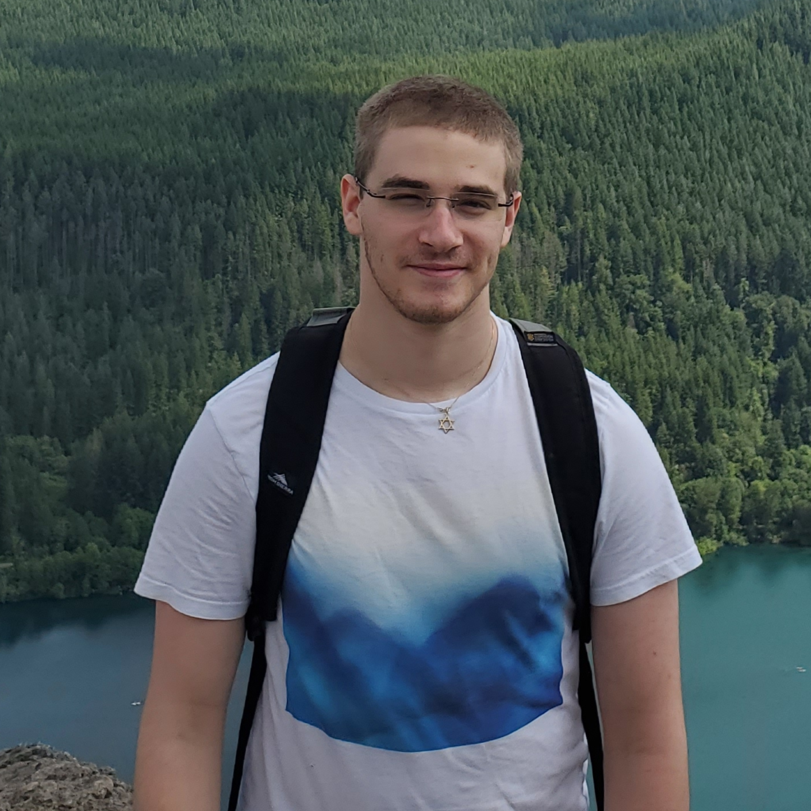

<title> About Avi </title>
<meta http-equiv="Content-Type" content="text/html; charset=UTF-8"/>
<meta name="viewport" content="width=device-width, initial-scale=1"/>
<link href="https://fonts.googleapis.com/css?family=IBM+Plex+Mono|Open+Sans" rel="stylesheet"/>
<link href="../stylesheet.css" rel="stylesheet"/>
<link rel="shortcut icon" type="image/png" href="/images/favicon.png"/>

# About me

<blockquote class="quote">
    *“People said I should accept the world. Bullshit! I don't accept the world.”*   **Richard Stallman**
</blockquote>

[Home](../index.html)

As you may already know, my name is Avi! Here I am:

Here's some tid-bits about me:

- I will be graduating from the University of Pittsburgh in December 2020 (Bachelor of Science, Computer Science), 2.33 years after graduating from high school.
- I am an immigrant, originally from Israel.
- I speak English and Russian fluently, and have varying mastery of other languages.
- I enjoy writing, and regularly write poetry or short stories (typically unshared, though there are some [here](../posts/index.html)).
- I'm passionate about learning, and spend a couple hours per day either reading/contributing to Wikipedia, or consuming other well-sourced informational content.

## Goals and plans

Currently, **I'm looking for a full-time software engineering role to start in Q1 2021**. However, due to the global pandemic of COVID-19, my priorities are flexible. 

Upon graduating, and relocating to the NYC area, I plan on pursuing the following goals:

1. Work towards completing, and eventually complete a working MVP of **rentnexus** (see below),
2. Learn about business, and establish a local non-profit for laptop re-use and repurposing.
	- Newer versions of Windows are too much for older (or lower-spec) machines. Linux is a great way to bring these laptops back to life, and also introduce people to *free* (as in freedom, but also cost) alternatives to proprietary, bloated and slow ways to use their computers.
	- I'd like to empower people who do not have the resources to use on laptops for work or school, by offering a free laptop for anyone who needs it.
3. Begin paying off my student loans, which I hope to fully pay off by 2024 (at the latest).

## Projects

These projects are projects I have worked on or am working on during my time in university.

- [rentnexus](https://rentnexus.net): A student-sourced subletting and renting listings platform for use by universities.
- [Synesthesia](https://github.com/avigloz/synesthesia): A program that creates interesting visual representations of audio files, written entirely in C++.

I have other projects through [my GitHub](https://github.com/avigloz).

## Contact

Here's my email address:
*avi [/\\t] avigloz [d0t] net*

**Do:** reach out for anything personal or business-related, but  
**don't:** try to sell me anything (at all).

If you're interesting in **tutoring services**, look [here](../tutoring/index.html).
