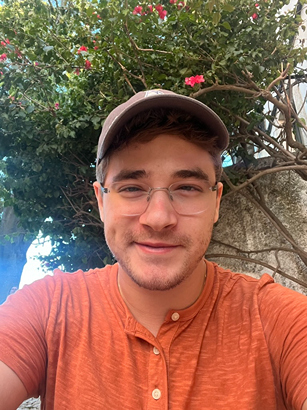

<head>
	<title> About Avi </title>
	<meta http-equiv="Content-Type" content="text/html; charset=UTF-8"/>
	<meta name="viewport" content="width=device-width, initial-scale=1"/>
	<link href="https://fonts.googleapis.com/css?family=IBM+Plex+Mono|Open+Sans" rel="stylesheet"/>
	<link href="../stylesheet.css" rel="stylesheet"/>
	<link rel="shortcut icon" type="image/png" href="/images/favicon.png"/>
	<svg style="display:none">
	<defs> <g id="external-link" stroke-width="1.5" stroke="#000" fill="none" stroke-linecap="round" stroke-linejoin="round"> <polyline points="17 13.5 17 19.5 5 19.5 5 7.5 11 7.5"></polyline> <path d="M14,4.5 L20,4.5 L20,10.5 M20,4.5 L11,13.5"></path> </g> </defs>
	</svg>
</head>

# About me

<blockquote class="quote">
    *“People said I should accept the world. Bullshit! I don't accept the world.”*   **Richard Stallman**
</blockquote>

[Home](../)

As you may already know, my name is Avi! Here I am:

Here's some tid-bits about me:

<blockquote>
- As of 2023, I am 23 years old. Calculating my age is quite easy!
- I graduated from the University of Pittsburgh in December 2020 (Bachelor of Science, Computer Science), 2.33 years after graduating from high school.
- I speak English and Russian fluently, and have varying mastery of other languages (Hebrew, Spanish, etc).
- I enjoy writing, and regularly write poetry or short stories (typically unshared, though there are some [here](../posts/index.html)).
- I'm passionate about learning, and spend a couple hours per day either reading/contributing to Wikipedia, consuming other well-sourced informational work on various subjects, or engaging in experimentation/tinkering.
</blockquote>
## Goals and plans

Currently, **I'm working as a Backend Engineer for a company called [Mercury<svg width="14px" height="14px" viewBox="0 -5 25 25"><use href="#external-link"></use></svg>](https://mercury.com)**.

I'm also hoping to become a published (self-published or otherwise) writer by the end of
2024. I am slowly building a collection of poetry to this end.

## Projects

Over the course of my teenage years and, later, my career, I've published numerous projects including browser extensions, tools for crypto mining, Minecraft server plugins, utilities, and more. 

In 2022, I released an NPM package called [**ahura**<svg width="14px" height="14px" viewBox="0 -5 25 25"><use href="#external-link"></use></svg>](https://www.npmjs.com/package/ahura), for managing package imports in Node.js.

Most of my meaningful work is stored publically on [my GitHub<svg width="14px" height="14px" viewBox="0 -5 25 25"><use href="#external-link"></use></svg>](https://github.com/avigloz). Browse to your heart's content! Of course, I have private repositories, too! ;)

## Contact

Here's my email address:
*avi [/\\t] avigloz [d0t] net*

If you're interesting in **tutoring services**, look [here](../tutoring/).

As I may reply to emails from my phone, I cannot reliably/consistently encrypt communication via email.\
For sensitive matters, please use the phone number on my résumé and contact me via Signal.
