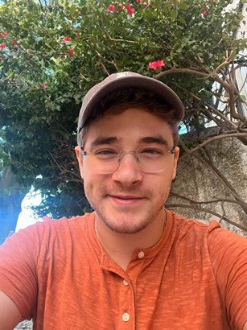

<head>
	<title> Avi's "Date Me Doc" </title>
	<meta http-equiv="Content-Type" content="text/html; charset=UTF-8"/>
	<meta name="viewport" content="width=device-width, initial-scale=1"/>
	<link href="https://fonts.googleapis.com/css?family=IBM+Plex+Mono|Open+Sans" rel="stylesheet"/>
	<link href="../stylesheet.css" rel="stylesheet"/>
	<link rel="shortcut icon" type="image/png" href="/images/favicon.png"/>
	<svg style="display:none">
	<defs> <g id="external-link" stroke-width="1.5" stroke="#000" fill="none" stroke-linecap="round" stroke-linejoin="round"> <polyline points="17 13.5 17 19.5 5 19.5 5 7.5 11 7.5"></polyline> <path d="M14,4.5 L20,4.5 L20,10.5 M20,4.5 L11,13.5"></path> </g> </defs>
	</svg>
	
</head>
<body oncopy="return false" oncut="return false" onpaste="return false">

## Hi! I'm Avi 👋 

*Welcome to my date-me-doc!*

I discovered this format thanks to a close friend, so here's an attempt at it :)

<b>high-level-summary/</b>

My name is Avi! I live in Brooklyn NY, and have a cat (with a funny name!). 

I speak English and Russian fluently (and know Spanish fairly well), and work as a software engineer in fintech.

In my free time, I enjoy:

- cooking 
- going on walks to a nearby park (especially when there's fewer people out, i.e early mornings and late evenings)
- listening to music (all kinds - *except most mainstream pop*)
- the occasional videogame (currently playing Baldur's Gate 3 with a couple friends)
- exploring the city and taking photos
- trying new foods/restaurants
- writing poetry
- travel (I've been to 13+ countries!)
- and more (keep reading 😛)

This year I will turn 24. I am 6'1" (185cm) tall.

Also, here's a selfie (might be especially useful if your dating heuristic prioritizes aesthetics):
 

 

 

<b>details/</b>

Alright, if you've made it this far, here's some more in-depth details about me:

<b>romantic-aspirations/ ❤️️💭</b>

I'm looking for a driven, open-minded, and emotionally mature partner who can deeply understand me and who I can deeply understand.

Someone who inspires and fascinates me, and with whom I can share hobbies, interests, moments, both great and bad days.
	
I aspire to travel the world, have children, and live a full life of quality and peace together with such a person.

Ideally, you'd have the following qualities (at least):

- you are a woman, between the ages of 22 and 26 this year
- you live in NYC full-time
- you also want kids (at most 2, probably)
- you like cats (*and* dogs) :)
- you don't mind waking up early, and savour catching the sunrise (earlybird > nightowl)
- you enjoy many of the same cuisines and foods as I do (E/S/SE Asian cuisines, Ethiopian, Middle Eastern, etc.)
- you're not an overly picker eater, and are curious to try new foods
- you love music as much I do, with us having some favorite artists/bands in common
- you enjoy a balance of being a homebody and an explorer
- you enjoy discussions on philosophy/other stimulating chat
- you speak more than one language or would consider yourself "cultured"/"worldly"
- you are an athiest

<b>goals/ 📋</b>

I'd like to (in the next 5 years)

- become a published poet
- start my own business (intuitively, some tech business, but I've pondered ideas like a cafe, publishing company, etc.)
- travel more (soon I will go to east Asia for the first time)
- learn Chinese (Mandarin)
- meet more friends and build my circles
- buy a house with a tea room, lots of houseplants, and a yard so that I can explore gardening, adopt a dog, and maybe have chickens
- learn how to make music (on my computer - I am deeply inspired by many IDM artists)
- etc!

(and, of course, I'd love to meet a partner)

<b>music/ 🎧</b>

Aside from family, friends, the blue sky, and the breeze, music is likely the most important thing to me.

*I could not live without it.*

I hope you feel the same way, as dating me would involve listening to (and probably discovering)
a lot of music together :)

I listen to many different genres, and have maintained a (now) very large collection of music since about 2015.

My all-time favorite musical artists include:

- Thievery Corporation
- Robohands
- Tosca 
- King Gizzard and the Lizard Wizard
- Boards of Canada
- Pond
- Aphex Twin
- BADBADNOTGOOD
- Morcheeba
- Tame Impala
- Altin Gün
- Interpol
- Infected Mushroom
- The Doors
- DIIV

Here's some Spotify playlists I actively maintain:

- [lifetime](https://open.spotify.com/playlist/1EQw7BQ7GDoqYc9AJumTjB?si=f60c5651f67e4018) - a playlist of almost every song I've ever "liked" since 2015
- [Total Focus](https://open.spotify.com/playlist/6TqfzDTDpoCXmTGka8zXpP?si=a9335f6a19164719) - my daily-driver flow-state playlist, meticulously curated
- [top 100](https://open.spotify.com/playlist/0VtRLaPcoRsJcWd8Kb5DTz?si=eef8a495ab7a4ba8) - an attempt to gather my top 100 songs, WIP
- [MWYW, Volume 1](https://open.spotify.com/playlist/4ZvhNle0VzfOb2Dx6dfYnD?si=e508f351bb944997) - one of the playlists I've made for an occasional work event called "Music While You Work"

<b>hobbies-and-pastimes/ 🏕</b>

Aside from cooking and music (and related things such as collecting records or buying fancy headphones), here's some other things:

- biking/cycling - NYC is super bikeable, and on a breezy, mellow sunny day it's bliss
- poetry - it serves as a valuable way to practice the art of metaphor, and as an emotional release
- video games - they're fun, especially with friends :)
- coding - mostly learning about programming languages, and small projects
- hiking - there's some wonderful nature not even 2 hours drive away from NYC, and I have yet to explore it all
	- I grew up in Seattle, and so hiking and nature is a deep part of me
- films/shows - high quality writing and cinematography is an incredible, deeply immersive experience
- photography - I'm not a pro, but I find it really enjoyable to take photos of beautiful things
	- I'm much better at landscapes than people, but maybe I just need a muse... 🤔
- wikipedia reading/contributing - it's a nice escape, to fall into the rabbithole
	- I've written a handful of articles (with over 1.3M total views!) and often make small edits to various articles
- books - in 2023 I started reading properly again
	- still working on being consistent with reading, but when I do read, it's very rewarding

<b>some-more-photos/ 📷</b>

<table>
  <tr>
    <td>
		
		
Mt. Rainier during sunset, Nov. 2023

	</td>
    <td>
			
		
My cat, Monkey :)

	</td>
    <td>
		
		
Lower Manhattan, as seen from DUMBO, Jan. 2024

	</td>
  </tr>
  <tr>
    <td>
		
		
A little pose at a house party, Jan. 2024

	</td>
    <td>
			
		
Lighthouse in Cascais, Portugal, Sep. 2023

	</td>
    <td>
		
		
My silly cat in a pot

	</td>
  </tr>
</table>

<b>food-and-diet/ 🍲</b>

At the moment I don't adhere to any particular diet, and would prefer to date someone with a flexible diet as well.

I have some food allergies, though they are minor and solved by antihistamine tablets.

I prefer "whole" foods, and foods which are organic (or analogous) - they just taste better, are more ethical, and sustainable.

Many of my meals are veg[an/etarian] but I love meat and seafood and eat it regularly as well.

Some of my favorite foods:

- borscht (via my own recipe)
- chicken wings (or any roasted/grilled chicken, honestly)
- soondubu jiggae with seafood
- simple salad (chopped tomato, cucumber, red onion, olive oil, salt, pepper)
- hong shao rou (红烧肉, "red-braised pork belly" with chestnuts)
- grilled marinated lamb ribs with lavash
- hummus with zhug and fresh pita
- massaman curry
- kari ayam (with potatoes)
- chicken bhuna
- salmon, trout, flounder/sole, squid, shrimp (prepared in basically any manner)
- steak, 30 day dry-aged beef prepared rare, with grilled asparagus
- coconut or orange flavored things, such as dark chocolates (70% cacao+)
- pork and shrimp siu mai (烧卖, probably my favorite dim sum dish)
- fries with mayonnaise - [very popular in Europe!](https://en.wikipedia.org/wiki/List_of_accompaniments_to_french_fries#Netherlands)

I also love both coffee and tea, and have them both regularly (but not together).

I don't drink alcohol very often (maybe 1 drink per week, if that) - there are less harmful alternatives.

<b>religion/ 📖</b>

I was brought up Jewish, but in practice am an athiest (and have no interest in organized religion of any kind).

I have ethical and philosophical disagreements with the Abrahamic religions (not limited to their approach to women's rights, outdated dietary rules, various hypocrisy, etc).

Taoism and Buddhism are much more attractive to me, and some of the philosophies therein inform my worldview.

<b>politics/ 🏛</b>

I am mostly apolitical/"politically ambiguous" (as far as how much I partake in and discuss politics).

If you insist on label(s), I am roughly a "*market-socialism-inclined progressive individualist libertarian.*"

Still, I don't think it's possible to capture my entire set of opinions in a set of labels without it getting absurdly contrived for everyone involved.

 

<i>interested? ✨</i>

Here's my email address:
*avi [/\\t] avigloz [d0t] net*

While my phone number *is* fairly easy to find, I'd prefer to chat over email (intially) in this context :)

<small>last updated: 1/26/2024</small>
